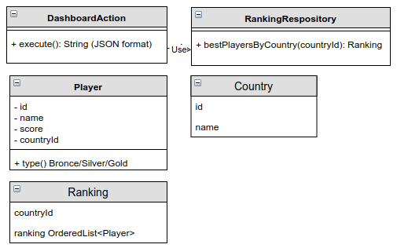
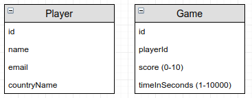

# Ranking Kata

## Description:
### Context
We have released an online computer game with some success. We log all played game results of each player.

### Business requirements
Our players have requested a ranking by country that they would like to integrate in other systems. We think that is a good idea and that feature will increase our gamers engagement, one of our key metrics.

For that new feature we only want to return the best 10 players for each of our 3 top countries where we have a lot of players: Spain, France and United Kingdom.

### Architecture requirements
We don't want to couple with the legacy system because it's done using an obsolete language/framework with a security issue.

We know that exist something called Anticorruption Layer, that allows us to decouple our new model from the old one. 

We would like to model our new business model with Players and Rankings.


DashboardAction is the service class that will be consumed from the API Rest.

RankingRepository will be used by DashboardAction to retrieve the users from the Anticurruption Layer.

### Legacy system


### Technical details
In our new model we want to use an ISO Standard for the country id's: [ISO_3166-2](https://en.wikipedia.org/wiki/ISO_3166-2)

We want the return an output as string in JSON format.

### Sample of output

```json
{
  "ES":[
    {"id":11,"name":"playerNameA","score":34},
    {"id":20,"name":"playerNameB","score":32},
    {"id":14,"name":"playerNameC","score":30}
  ],
  "FR":[
    {"id":174,"name":"playerNameX","score":43},
    {"id":167,"name":"playerNameY","score":42},
    {"id":155,"name":"playerNameZ","score":40}
  ],
  "GB":[
    {"id":202,"name":"playerNameR","score":38},
    {"id":253,"name":"playerNameS","score":36},
    {"id":288,"name":"playerNameT","score":35}
  ]
}
```

### How to setup the legacy system

#### Option 1: Use the DB provided by [Codium](https://www.codium.team)

#### Option 2: Build your own database

You need docker to 

    docker run --name ranking-kata-database -v "$PWD:/home/" -e MYSQL_ROOT_PASSWORD=ranking -p 3306:3306 -d mariadb

    docker exec -it ranking-kata-database sh -c "mysql -u root -pranking < /home/legacy_db_script.sql"

The mysql connection information is:
- host: localhost
- port: 3306
- database name: *last_survival*
- password: *ranking*


## Goals
- Understand how to decouple a legacy system from a new one.
- The importance of a good model and frontiers.

## Authors
Luis Rovirosa [@luisrovirosa](https://www.twitter.com/luisrovirosa)

Jordi Anguela [@jordianguela](https://www.twitter.com/jordianguela)